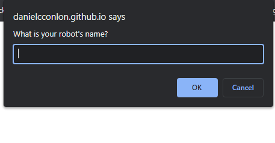

# robot-gladiators

- Github URL: https://github.com/DanielCConlon/robot-gladiators
- github pages: https://danielcconlon.github.io/robot-gladiators/

## Table-of-Contents

- [Description](#description)
- [Usage](#usage)
- [Application](#application)

## [Description](#description)

Robot gladiators is a MVP browser game created following the steps of a course module using JavaScript.

## [Usage](#table-of-contents)

Go to the website and follow the prompts on the screen.

## [Application](#table-of-contents)

